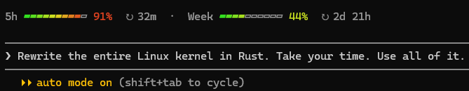
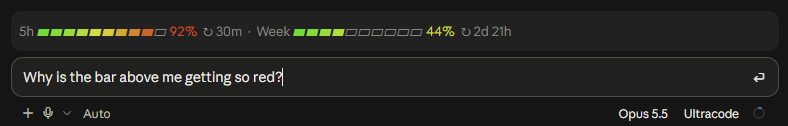

# burnbar

A Claude Code plugin that shows how much of your Claude usage limits you've used, right above the prompt:



And in the Claude desktop app's Code tab:



- One bar per limit window (5-hour and weekly) that fills as you use it, segments fading green → red
- Percentage used, coloured green → red as it climbs; dimmed countdown to each reset
- **details** at the end of the strip, or `/burnbar`, opens a larger side panel with the same bars
- Colours tuned to Claude Code's `theme` setting: brighter for dark themes, darker for light ones, and an in-between palette for `auto`

Readings come from Claude Code itself after each reply, so the strip appears once Claude has answered at least once. Only Pro and Max subscriptions report usage limits; on API billing it stays hidden.

**Works in:** Claude Code, in the terminal and in the Claude desktop app's Code tab. The plugin can be added on claude.ai and in Cowork, but it has nothing to show there: it draws only in Claude Code's interface.

## Examples

1. **See your limits as you work.** Send Claude any prompt, for example `Write a haiku about off-by-one errors`. When the reply finishes, the strip appears above the prompt showing the 5-hour and weekly windows, how much of each you've used, and when each resets.
2. **Open the detailed panel.** Click **details** at the end of the strip, or type `/burnbar`. A side panel opens with a larger bar per window, the exact percentage used, and "resets in" times.
3. **Check it adapts to your theme.** Run `/theme` and pick a light theme: within a minute, or after Claude's next reply, the bars switch to a darker palette, so yellow and green stay readable on a white background. Pick `auto` and they use an in-between palette.
4. **Watch a window fill up.** During a long session the 5-hour bar grows from green toward red, and its percentage turns red as it nears 100%.

## Install

One command, the same on macOS, Linux and Windows:

```bash
claude plugin install burnbar --marketplace akaaff/burnbar
```

Restart Claude Code (or run `/reload-plugins`). Update later with `claude plugin update burnbar@burnbar`; remove with `claude plugin uninstall burnbar@burnbar`.

Or from inside Claude Code:

```
/plugin marketplace add akaaff/burnbar
/plugin install burnbar@burnbar
```

## Manual install (to hack on it)

Clone the repo, point Claude Code at the folder in `~/.claude/settings.json`, then restart Claude Code. Edits to the folder reload live.

### macOS / Linux

```bash
git clone https://github.com/akaaff/burnbar ~/burnbar
```

```json
{
  "env": {
    "CLAUDE_CODE_PLUGIN_DIRS": "~/burnbar"
  }
}
```

### Windows

```powershell
git clone https://github.com/akaaff/burnbar $HOME\burnbar
```

```json
{
  "env": {
    "CLAUDE_CODE_PLUGIN_DIRS": "C:\\Users\\<you>\\burnbar"
  }
}
```

Backslashes must be doubled inside JSON.

### Notes (manual install)

- Already have an `env` block? Add the `CLAUDE_CODE_PLUGIN_DIRS` line to it rather than adding a second block.
- Several plugin folders go in the same variable, separated by `:` on macOS/Linux and `;` on Windows.
- For a single terminal session instead: `claude --plugin-dir <path>`.
- If the bars show as boxes, your font lacks `▰`/`▱`; swap them in `segments()` for e.g. `#`/`-`.

## What it accesses

- **Reads:** the usage-limit figures Claude Code already reports after each reply (percent used and reset time per window), and Claude Code's `theme` setting to pick a palette (`auto` gets an in-between palette, since plugins can't see which background the terminal has).
- **Stores:** only those figures, in Claude Code's per-session plugin state; nothing is written to disk.
- **Sends:** nothing. The plugin makes no network requests, runs no processes and reads no files.

## Troubleshooting

| Symptom | Cause and fix |
| --- | --- |
| No strip above the prompt | Claude Code reports usage only after a reply, so send one prompt first. On API-key billing there are no limits to report, and the strip stays hidden. It also steps aside while Claude Code shows a survey. |
| `/burnbar` says the command doesn't exist | The plugin isn't loaded: check `claude plugin list`, then restart Claude Code. |
| The panel doesn't open by itself | It only opens when you ask: type `/burnbar`. In a fullscreen terminal it docks beside the transcript at full height. That's Claude Code's layout. |
| Colours look pale or too dark | The palette follows Claude Code's `theme` setting, not your terminal's or the desktop app's appearance. Set `/theme` to match your background, or use `auto`. |
| Bars show as boxes or question marks | Your font lacks `▰` / `▱`. Use a font that has them, or change the characters in `segments()`. |
| Reset countdown is missing | Claude Code didn't report a reset time for that window; it reappears with the next reading. |

## Support

Questions and bugs: [open an issue](https://github.com/akaaff/burnbar/issues) on GitHub.

Security issues: please report them privately, as described in [SECURITY.md](SECURITY.md).

## Customising

Everything is in [`hooks/register.tsx`](hooks/register.tsx):

| What | Where |
| --- | --- |
| Segment characters | `segments()` (`▰` / `▱`) |
| Colours, and the dark / light / auto palettes | `TONES` and `gradient()` |
| Strip layout and spacing | the `AbovePrompt` render hook |
| Side panel | the `Pane` render hook |

## Development

```bash
claude plugin validate .
claude plugin test .
```

## License

MIT, see [LICENSE](LICENSE).
